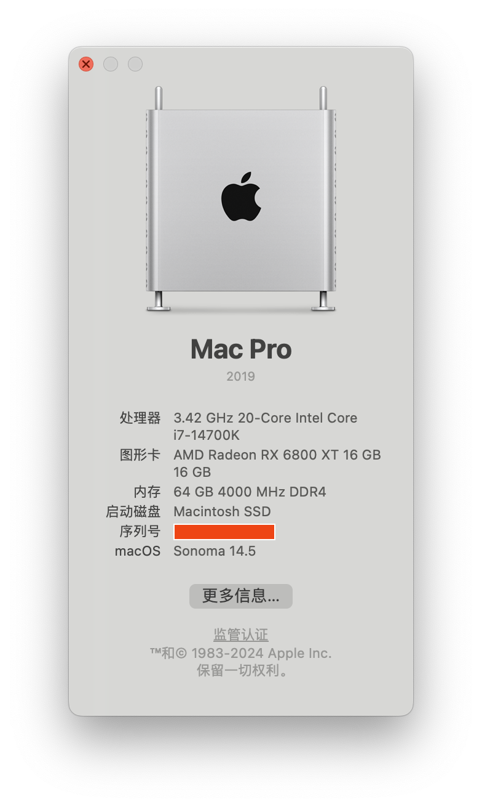

# ASRock Z690 Extreme Wifi 6E Hackintosh EFI

EFI Partition and Guidelines for my 14th Intel Hackintosh.




## Changelog

```
0.0.1 - initial release
0.0.2 - update cpu to 14700k
```

## Hardware

Component | Model
--- | ---
Motherboard | ASRock Z690 Extreme WiFi 6E
CPU | Intel Core i7 14700K
GPU | YESTON RX6800XT 16G
Memory | KINGBANK 2x32GB DDR4-3600CL18
NVME | Predator SSD GM7000 1TB
Cooler | Thermalright Frozen Notte 360 WHITE ARGB
Case | Segotep Memphis Gaming PC Case White
Power Supply | SAMA Power Supply 750W Gold Black
Wifi/BT | Intel AX210

## UEFT Basic Settings

- Load UEFI Defaults
- XHCI Hand-off - on (Optional)

## Overclock

- P-Core frequency: 1 core 5.8G, all core 5.4G
- Memory frequency: 4000 MHz
- Core voltage: 1.2v at 5.4G, 3.2v at 5.8G
- Package temperature : 35°C when idle, 60°C when 1 core busy (40 Watts), 70°C when all cores busy (220 Watts)

### USB Ports Map

Name | U2 Port | U3 Port | Active | Comment
--- | --- | --- | --- | ---
F_USB32_TC_1 | 0x1 | 0x11 | All | Front type-c header
USB_3_4 | 0x9, 0xa | NA | None
USB_1_2 | 0xb, 0xc | NA | None
USB3_5_6, USB3_7_8 | 0x8 | 0x18 | All | Connected with ASMedia ASM1074 hub
M2_WIFI | 0xe | NA | U2 Only |
LED Controller | 0xd | NA | None |
USB3_3 | 0x2 | 0x13 | U2 only | For mouse or keyboard
USB3_4 | 0x3 | 0x12 | U2 only | For mouse or keyboard
USB31_TA_1 | 0x7 | 0x17 | All
USB31_TC_1 | 0x6 | 0x16 | All
USB3_1 | 0x5 | 0x15 | All | ACPI wake-up function is not supported
USB3_2 | 0x4 | 0x14 | All | ACPI wake-up function is not supported


Full usb ports list is defined at [here](./usb_ports.plist).  The 15 actived usb ports is defined in  `Info.plist` of `USBPorts.kext`.

## Intel Power Gadget


## Benchmarks

<https://browser.geekbench.com/v6/cpu/7171676>


<https://browser.geekbench.com/v6/compute/2548018>


https://browser.geekbench.com/v6/compute/2548671


